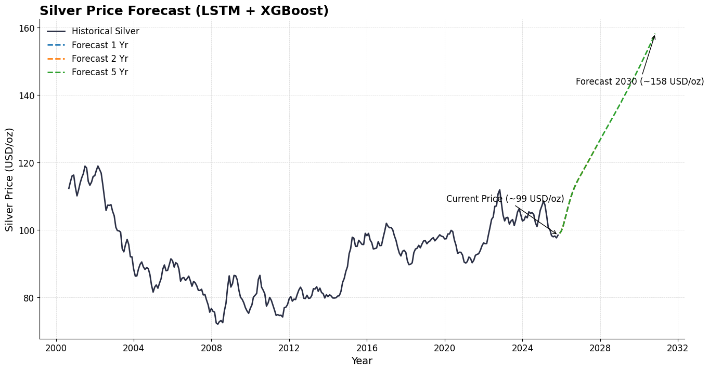

# 🔍 Silver Price Forecast: Story & Key Insights  

## 🖼 The Chart (Silver Price Forecast, LSTM + XGBoost)

Your chart shows:

- A dark solid line representing **historical silver prices** (from ~2000 to ~2025).  
- Dashed/dotted projections for **1-year (blue)**, **2-year (orange)**, and **5-year (green)** futures.  
- A forecasted price of about **158 USD/oz around 2030**, annotated as “Forecast 2030 (~158 USD/oz)”.  
- An annotation pointing to the **current price (~99 USD/oz)** as the starting base.  

This visual conveys the model’s belief: silver could rise significantly over the next 5 years under the patterns it has learned.

---

## 📈 What the Forecast Implies  

### 1️⃣ Growth Multiple & Expectations  
From the annotated **~99 USD/oz today** to **~158 USD/oz in 2030** — that implies roughly **1.6× growth** over 5 years (~ 60 % increase).  

In simple terms: if this model is correct, silver prices could be **60 % higher in 2030** than they are now (in USD terms).

---

### 2️⃣ Drivers Behind the Rise (Captured by the Model)  

- The **LSTM + XGBoost** hybrid learns from historical patterns of price movement: momentum, cycles, volatility, and co-movement with gold and the USD index.  
- It implicitly assumes that **past behavior** under crises, recoveries, and trends will partially repeat in the future.  
- It uses **external variables** (gold prices, USD index) to adjust the forecast beyond pure autoregression.

---

## ⚠️ Other Factors That Could Shift Silver Prices (Not in the Model)

Even though the LSTM + XGBoost model captures many historical patterns, several **external factors—currently not included—could significantly alter future silver prices.**  

Here are the key ones:

### 🧩 Industrial & Technological Demand  
A surge in demand from **electronics, photovoltaics, medical devices, or green energy** could push silver prices higher than projected.  

### ⛏ Supply Constraints or Mineral Depletion  
If **mining yields decline**, costs rise, or production is disrupted (labor issues, regulation, geology), supply could tighten → higher prices.  

### 🏦 Monetary & Fiscal Policy Shifts  
**Central bank actions** (rate cuts, QE, inflation targets), government stimulus, and currency debasement influence precious-metal valuations deeply.  

### 🌍 Geopolitical & Systemic Shocks  
**Wars, trade sanctions, financial crises**, or sudden market crashes can trigger flight-to-safety behavior, causing spikes or volatility.  

### 💱 Currency & Exchange Rate Dynamics  
Because silver is priced in USD, major movements in USD (or your local currency such as INR) could amplify or erode the realized gains.  

### 💹 Investor Sentiment & Speculative Flows  
**ETF flows, hedge fund positioning, and market hype** can cause overshoots or crashes beyond historical patterns.  

---

## 🧠 Model Improvement Path  
If you integrate **demand data, mining supply data, monetary policy metrics, or shock event flags** into the model, you can refine and stress-test this forecast further.

---

*Disclaimer: This forecast is for analytical and educational purposes. Financial markets are inherently uncertain and influenced by complex, interlinked real-world factors.*
